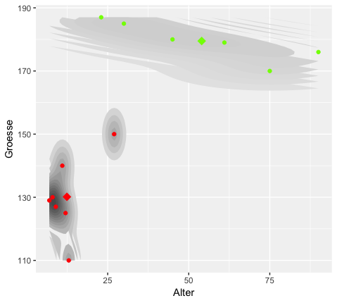
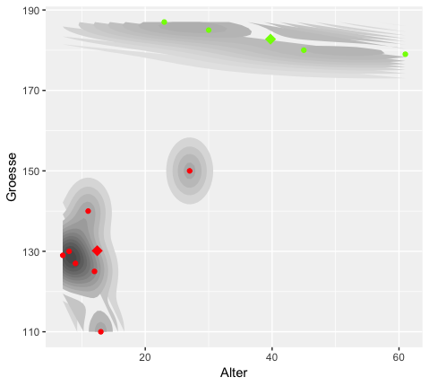
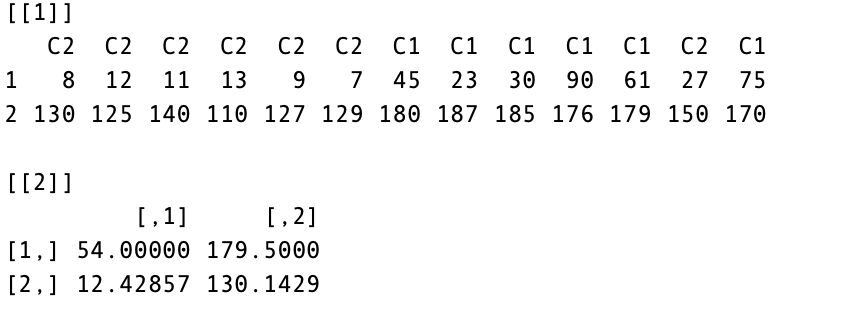
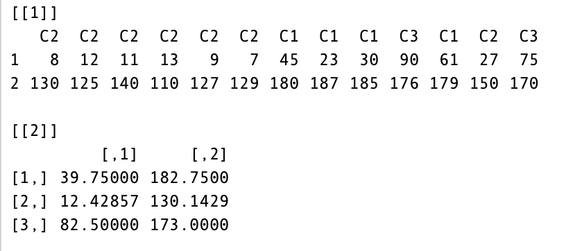
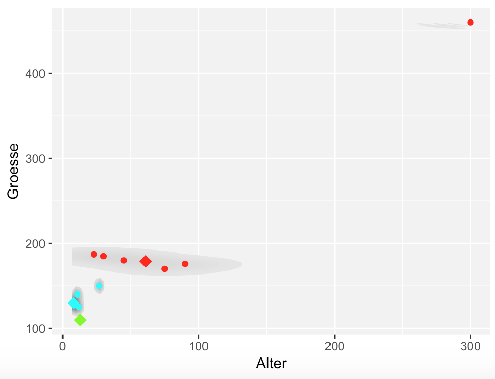
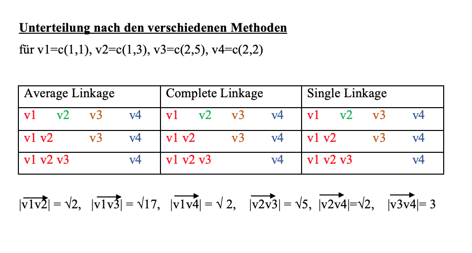
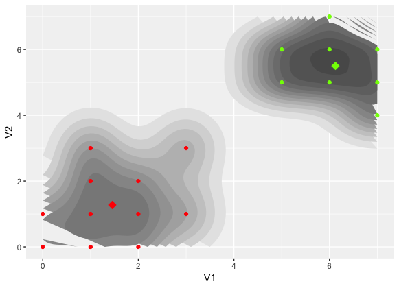
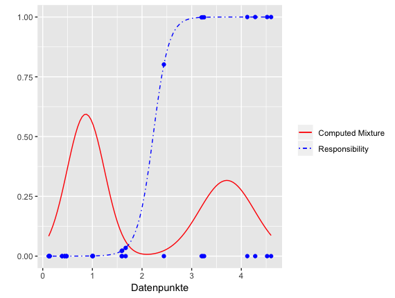

```{r}

```

```{r setup, include = FALSE}
knitr::opts_chunk$set(
  collapse = TRUE,
  comment = "#>"
)


```

**Was ist Clustering?** 
----------------------------------------------------------------------------------

Bei der Clusteranalyse werden Datenbestaende genommen und sortiert. Die Sortierung erfolgt dabei durch eine Unterteilung in Untergruppen, die sogenannten *Cluster*. 
Ziel ist es, die Cluster so zu bilden, dass Objekte, welche sich in einem gemeinsamen Cluster befinden, mehr Aehnlichkeiten zueinander aufweisen als solche, die sich in einem anderen befinden. Auf welche Gemeinsamkeiten dabei geachtet wird, variiert abhaengig von der gewaehlten Methode.

In dem Ihnen zur Verfuegung stehenden Paket wird sich dabei auf numerisch bedingtes Unterteilen fokussiert. Dies bedeutet, dass die eingegebenen Observationen von einem quantitativen Typ sein muessen. Vorausgesetzt wird dies, da hier alle Sortierungen auf Abstandsberechnungen basieren.

Wie genau dies funktioniert und welche verschiedenen Moeglichkeiten es dafuer gibt, folgt nun in einer detaillierten Erklaerung der Algorithmen.

**Beispiel 1:<br>**

Anhand dieses Besiepiels werden nun die in unserem Paket vorkommenden Algorithmen miteinander verglichen und naeher veranschaulicht.<br>

|Messwerte||||||||||||||Riese|
|-+-+-+-+-+-+-+-+-+-+-+-+-+-+-+-+-+-+-+-+-+-+-+-|
|Alter(Jahre):|8|12|11|13|9|7|45|23|30|90|61|27|75|300|
|Groesse(cm):|130|125|140|110|127|129|180|187|185|176|179|150|170|460|


**K-Means Algorithmus**
-----------------------------------------------------------------------------------

Der K-Means Algorithmus bildet Cluster aufgrund der euklidischen Distanz der Objekte zu den Clusterzentren. Dabei wird bereits anfangs vom Nutzer eine feste Anzahl N an gewuenschten Clustern definiert, welche sich dann waehrend dem Algorithmus auch nicht mehr veraendern. Beginnend werden die Clusterzentren zufaellig platziert.

Der K-Means Algorithmus ist ein sehr beliebter Algorithmus, da er sehr schnell ist und wenig Speicherplatz bedarf. Das Unterteilen mittels der Euklidischen Distanz erfordert aber einen quantitativen Datentyp als Eingabe, also eine Eingabe, bei der eine Abstandsmessung machbar und sinnvoll ist.

----------------------------------------------------------------------------------
*ALGORITHMUS*<br>

**Eingabe**: Den Datensatz und Anzahl N der Cluster <br>
**Ausgabe**:  Cluster und Clusterzentren <br>

**Verfahren**:<br>
*1.Schritt*: Waehle zufaellig N Zentren im Raum<br>
*2.Schritt*: Berechne den Euklidischen Abstand der Punkte zu den Zentren und ordne                die Punkte dem Cluster zu, bei welchem der Abstand zum Clusterzetrum am               geringsten ist. Finde also das Minimum von einem Punkt zu den        Zentren<br>
*3.Schritt*: Berechne den Mittelwert der Punkte in den Clustern und setze diese                dann als neue Zentren<br>
*4.Schritt*: Wiederhole Schritt 2. & 3. solange, bis die Zentren konvergieren, d.h.           sich bei der naechsten Iteration nicht mehr stark veraendern.<p>
-------------------------------------------------------------------------------------


Table: Vor- und Nachteile des Algorithmus

  
  | Vorteile | Nachteile  |
|-----+-------|
|- schnelle Laufzeit |-Schlechte Wahl der Anfangszentren:|
|- wenig Speicherbedarf|   * dauert laenger  |
|- erkennt viele Datentypen|   * erkennt nat. Cluster nicht|

<br>
<br>
-> TIPP: 1. Den  K-Means Algorithmus mehrmals durchlaufen lassen, um den daraus resultierenden besten Wert entnehmen zu koennen. <br> 2. Um etwas Laufzeit einzusparen, bietet es sich an, die Clusterzentren zu Anfang geschickt zu platzieren.
<br>
<br>


<br>
1.Bild: Die Sortierung des Beispiels fuer 2  gewuenschte Cluster(ohne den Riesen)<br>
2.Bild: Die Sortierung des Beispiels fuer 3  gewuenschte Cluster(ohne den Riesen)         


**K-Medoids Algorithmus**
------------------------

K-Medoids verlaeuft grundsaetzlich aehnlich wie der K-Means Algorithmus. Eine Unterscheidung gibt es nur in zwei Punkten. <br>

1. Als Clusterzentren nutzt K-medoids nicht einfach den Mittelwert, sondern waehlt dafuer eingegebene Datenpunkte, welche am zentralsten liegen (Vektor-Mediane).
2. Die Methode zur Abstandsberechnung ist variabel, sie muss also nicht mithilfe der euklidischen Distanz berechnet werden.

-> Die beiden genannten Punkte haben zur Folge, dass K-Medoids im Gegensatz zu K-Means sensibler gegenueber Ausreissern ist. 

-------------------------------------------------------------------------------------

*ALGORITHMUS*<br>

**Eingabe**: Datenobjekte und Anzahl der gewuenschten Cluster K<br>
**Ausgabe**: Zentren der Cluster (aber im Sinne von die Objekte welche am zentriertesten sind) <br> 

**Verfahren**:<br>
*1.Schritt*: waehle  K Elemente aus dem Datensatz und setze diese als Zentren fest.<br>
*2.Schritt*: Berechne den Abstand der anderen Datenpunkte zu den Zentren und ordne sie dem ihnen am naechsten stehendem Zentrum zu.<br>
*3.Schritt*: Berechne nun in den enstandenen Clustern erneut die Zentren.<br>
*4.Schritt*: Iteriere ueber Schritt 2 & 3 analog zum K-Means, bis die Werte konvergieren.

-------------------------------------------------------------------------------------

**Blick auf Beispie 1:**

Im obigen Beispiel hat sich ein Ausreisser eingeschlichen. Die Messwerte eines Riesen wurden dem Datensatz hinzugefuegt. Nun sieht man den Unterschied zwischen K-Medoids und dem K-Means besonders deutlich. Bei der Anwendung der Algorithmen mit drei Clustern, erfolgt die Sortierung wie folgt: 

<br>
<br>

 
<br>
<br>
Waehrend K-Means den Riesen als Aussenseiter in ein Cluster setzt, wirkt sich dies bei K-Medoids nicht so erheblich aus. Da wie oben gennant dieser sensibler fuer Aussreisser ist.


**Agglomerative Clustering**
----------------------------

In dieser Clustermethode werden zu Beginn alle Observationen als einzelne Cluster angesehen und im weiteren Verlauf dann immer paarweise zusammengefuehrt.
Angenommen es gibt 8 Observationen, dann beginnt man mit 8 Clustern. Daraufhin werden die zwei naechststehenden zusammengefuehrt und uebrig bleiben 7 Cluster, danach fuegt man die naechsten zwei Cluster zusammen usw. bis zum Schluss nur noch 2 Cluster vorhanden sind. 
Der Algorithmus benoetigt damit bei N Observationen N-1 Schritte.

*Wie vergleicht man nun aber zwei Cluster G und H in denen sich mehr als ein Datenobjekt befindet?*

Dies geschieht durch komponentenweisen Vergleich. Jedes Objekt aus G wird also mit jedem Objekt aus H verglichen. 

Die Zusammenfuehrung der Cluster kann dabei auf verschiedene Weisen geschehen: 

**1. Average Linkage**<br>

Beim Average Linkage werden die Cluster zusammengefuegt, bei denen die Mittelpunkte innerhalb der verschiedenen Cluster den geringsten Abstand zueinander aufweisen.  
<br>

**2. Complete Linkage**<br>

Bei Complete Linkage werden die Cluster zusammengefuegt, bei denen 2 Elemente den weitesten Abstand zueinander aufweisen. Das wird erst dann relevant, wenn mehr als ein Element sich in einem Cluster befindet und sollte wie folgt verstanden werden. 
Seien die Punkte x und y in einem Cluster und a und b zwei weitere Punkte. Nun sei der Abstand von x zu b groesser, als der von y zu b und der von y zu a groesser, als der von y zu b. Dann wird die Strecke
von x zu b und von y zu a verglichen. Wenn nun die Strecke xb *kleiner* ist als die von y zu a, wird der Punkt b dem Cluster(x&y) hinzugefuegt.

**3. Single Linkage**<br>

Beim Single Linkage werden die Cluster zusammengefuegt, bei denen 2 Elemente aus verschiedenen Clustern den geringsten Abstand zueinander aufweisen.


Beispielhaftes Ergebnis fuer gegebene Messwerte: 

 

**EM-Algorithmus**
--------------------

Zuerst muuss die im Folgenden beschriebene Unterscheidungen getroffen werden. Zum Einen gibt es das sog. *hard clustering*, bei dem sich ein Objekt entweder in einem Cluster befindet oder nicht. Diese Aufteilung ist eindeutig. Dem entgegengesetzt steht das sogenannte *soft clustering*, in welchem nur eine Wahrscheinlichkeit angegeben wird, mit der sich ein Objekt in dem einen oder anderen Cluster befindet. Beim ersten koennen die Cluster also ueberlappen und beim zweiten nicht. 

Der EM Algorithmus ist eine Methode, welche fuer das soft clustering verwendet werden kann. Er hat das Ziel, die Dichtefunktion, also genauer den Erwartungswert und die Varianz eines Datensatzes, zu bestimmen und gleichzeitig dessen Mischverhaeltnis anzugeben. Bei dem im Paket zur Verfuegung stehenden Algorithmus wird sich auf Folgendes beschraenkt:   

 * Die eingegebenen Datenpunkte sind eindimensional <br>
 * Es handelt sich um eine Normalverteilung <br>
 * Es existieren nur zwei Cluster, d.h es wird von zwei Normalverteilungen ausgegangen
 
Unter diesen Einschraenkungen spricht man von einem *"two component mixture model"* 

**Beispiel 2:** Gegeben seien folgende Werte:

|Gruppe:| A|||||||||B|||
|-+-+-+-+-+-+-+-+-+-+-+-+-+-+-+-+-+-+-+-+-+-+-+-|
|Messwerte:|0.39|0.12|0.14|0.48|0.44|1.01|1|1.59|1.6|1.67|2.44|3.2|3.22|3.25|4.12|4.28|4.52|4.6|

Wir wissen aber in unserem Fall weder, welche Daten der Gruppe A bzw. B angehoeren, noch kennen wir den Erwartungswert oder die Varianz. Waere naemlich eines der beiden bekannt, liesse sich das jeweils andere leicht berechnen. 

Fuer einen solchen Fall eben benoetigt man den EM-Algorithmus, da dieser iterativ die Erwartungswerte sowie die zugehoerigen Varianzen berechnet und diese mit passendem Mischverhaeltnis zurueckgibt.

Als wichtiger Unterschied ist noch aufzufuehren, dass der EM-Algorithmus, im Gegensatz zum K-Means beispielsweise, als Mischverhaeltnis niemals eins oder null angibt sondern lediglich eine Zahl im offenen Intervall (0,1). 


-------------------------------------------------------------------------------------

*ALGORITHMUS*:<br>

**Eingabe**: Eindimensionaler Datensatz<br>**Ausgabe**: Erwartungswert, Varianz und Mischverhaeltnis<br>**Verfahren**:<br>*1. Schritt*(Initialisation Step) : Initialisierung der Variablen (es gibt hier verschiedene Varianten)<br>*2. Schritt*(Expectation Step): Berechnen der Ewartungswerte und Varianzen, sowie das Mischverhaeltnis pi, zu den gegebenen Variablen aus dem 1. Schritt.<br>*3. Schritt*(Maximization Step): Wiederhole 2 solange bis die Werte konvergieren

-------------------------------------------------------------------------------------

Das Endergebnis zum obigen Beispiel sieht graphisch dargestellt dann folgendermassen aus:

 


Eine Anleitung zur Nutzung unseres Pakets finden Sie in einer gesonderten Vignette.
