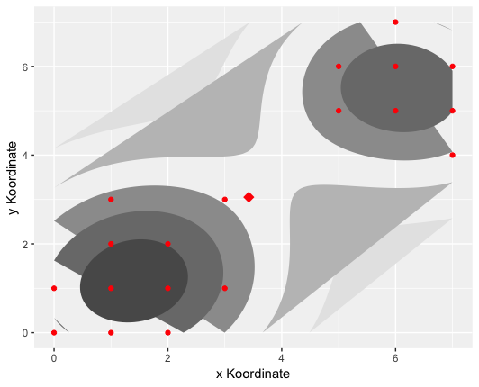

```{r setup, include = FALSE}
knitr::opts_chunk$set(
  collapse = TRUE,
  comment = "#>"
)
```

**Inhalt**
-------------------------------------------------------------------------------------
```{r, echo= FALSE, eval= TRUE, results= FALSE}
############################################################
# Euclidian Norm eDist an Euclidian Distance eDist
############################################################

eNorm <- function(x) return(sqrt(sum(x^2)))

eDist <- function(x,y) return(eNorm(x-y))

############################################################
############################################################
# guess random centers from given datapoints (return in matrixform)
############################################################
gsCenters <- function(k, data) {
  s = sample(data, size = k)
  m <- matrix(0, nrow=k, ncol = nrow(data))
  for(i in 1:k) {
    m[i,] = s[,i]
  }
  return(m)
}
############################################################
############################################################
# Matrixnorm "maNorm(M)" of Matrix M : Euclidian Matrixnorm
############################################################
maNorm <- function(m,d){
  vec <- numeric(length = nrow(m))
  for(i in 1:nrow(m)){
    for(j in 1:ncol(m)){
      vec[j] <- d(m[,j],0)
    }
    s <- sqrt(sum(vec))
  }
  return(s)
}
############################################################
############################################################
# kMeans
############################################################

k_means <- function(data, N, means = gsCenters(N,data), tol = 0.001, maxIter = 10, d = eDist){

  len <- length(data)
  dm <- nrow(data)
  clusterof <- numeric(length = len)

  m <- means
  m_old <- matrix(0, nrow = N, ncol = dm)

  iter <- 0

  while(maNorm(m - m_old, d) >= tol && iter <= maxIter) {
    iter <- iter + 1
    m_old <- m
    dism <- matrix(nrow=N, ncol = len)


    # step 1:
    # for all datapoints compute distance of datapoint to all mean values,
    # find minimum
    # and update cluster of datapoint

    for(i in 1:len){
      for(j in 1:N){
        dis <- d(data[i], m[j,])
        dism[j,i] <- dis
        clusterof[i] <- which.min(dism[,i])
      }
    }


    # step 2:
    # update mean-values
    for(k in 1:N){
      size_k <- 0
      sum_k <- numeric(length = length(m[1]))
      for(i in 1:len){
        if(clusterof[i] == k){
          data_i <- t(data[i])
          size_k <- size_k + 1
          sum_k <- sum_k + data_i
        }
        if(size_k != 0){
          m[k,] <- ((1/size_k)*sum_k)
        }
        else{
          m[k,] <- m_old[k,]
        }
      }
    }
  }
  data <- data[, order(clusterof)]
  Cs <- paste0(rep("C",length(clusterof)),sort(clusterof))
  names(data) <- Cs

  m <- as.data.frame(t(m))
  colnames(m) <- paste("C", 1:length(m), sep = "")

  return(list("cluster" = data, "means" = m))
}

```

```{r, echo= FALSE, eval= TRUE, results= FALSE}
cluster_plot <- function (df, cluster_center = NULL, nclusters = 2, g_mixture = FALSE,
                         theta_comp = c(0.5, 0, 0.1, 1, 0.1), theta_cor = NULL,
                         x_label = "X-Achse", y_label = "Y-Achse") {
  if (isTRUE(g_mixture)) {

   g_mix_fun <- function (x, theta) {
     return((1-theta[1])*dnorm(x, theta[2], theta[3]) +
              theta[1]*dnorm(x, theta[4], theta[5]))
   }
   responsibility <- function (x, theta) {
     theta[1]*dnorm(x,mean=theta[4],sd=sqrt(theta[5]))/
       ((1-theta[1])*dnorm(x,mean=theta[2],sd=sqrt(theta[3]))+theta[1]*dnorm(x,mean=theta[4],sd=sqrt(theta[5])))
   }

   df <- as.data.frame(df)
   df <- cbind(df, as.data.frame(sapply(df, function(x) responsibility(x, theta_comp))))
   df <- cbind(df, as.data.frame(rep(0, nrow(df))))
   colnames(df) <- list("V1", "V2", "V3")
   g_mix_data <- as.data.frame(seq(min(df["V1"], max(df["V1"]), length.out = 1000)))
   g_mix_data <- rbind(rep(0, 1000))
   g_mix_data <- as.data.frame(g_mix_data)
   colnames(g_mix_data)[1] <- "V1"
   colnames(g_mix_data)[2] <- "V2"
   theta_comp <- as.vector(theta_comp)

   c_plot <- ggplot(df)

   if (!is.null(theta_cor)) {
     theta_cor <- as.vector(theta_cor)
     c_plot <- c_plot + stat_function(g_mix_data, mapping =
                                        aes(colour = "Correct Mixture"),
                                      fun = g_mix_fun, args = list(theta_cor),
                                      show.legend = TRUE)
   }

   c_plot <- c_plot + stat_function(g_mix_data, mapping =
                                    aes(color = "Computed Mixture"),
                                    fun = g_mix_fun, args = list(theta_comp),
                                    show.legend = TRUE) +
     stat_function(g_mix_data, mapping = aes(color = "Responsibility"),
                   fun = responsibility, args = list(theta_comp), linetype = "dotdash",
                   show.legend = TRUE) +
     geom_point(mapping = aes(V1, V2, color = "Data"), color = "blue", show.legend = FALSE) +
     geom_point(mapping = aes(V1, V3, color = "Data"), color = "blue", show.legend = FALSE) +
     xlab(x_label) + ylab(y_label)

   if (is.null(theta_cor)) {
     c_plot <- c_plot + scale_colour_manual(name = element_blank(), values =c("red", "blue"),
                           labels = c("Computed Mixture", "Responsibility"),
                           guide = guide_legend(override.aes = list(
                             linetype = c("solid", "dotdash"),
                             shape = c(NA, NA))))
   } else {
     c_plot <- c_plot + scale_colour_manual(name = element_blank(), values =c("red", "green", "blue"),
                           labels = c("Computed Mixture", "Simulated Mixture", "Responsibility"),
                           guide = guide_legend(override.aes = list(
                             linetype = c("solid", "solid", "dotdash"),
                             shape = c(NA, NA, NA))))
   }

   print(c_plot)

  } else {
    if (length(unique(colnames(df))) < nclusters){
      nclusters <- length(unique(colnames(df)))
    }
    cluster_list <- list()
    for (k in 1:nclusters) {
      cluster_list[[k]] <- as.data.frame(t(df[which(colnames(df) == unique(colnames(df))[k])]))
      colnames(cluster_list[[k]])[1] <- "V1"
      colnames(cluster_list[[k]])[2] <- "V2"
    }

    if (nclusters < 5) {
      plot_colors <- rainbow(4)
    } else {
      plot_colors <- rainbow(nclusters)
    }

    c_plot <- ggplot() + scale_fill_gradient(low = "grey90", high = "grey35") +
      theme(panel.background = element_rect(fill = "grey95"))

    for (k in 1:nclusters) {
      if (nrow(cluster_list[[k]]) > 2) {
        c_plot <- c_plot + stat_density_2d(cluster_list[[k]], mapping =
                                            aes(V1, V2, fill = ..level..), geom =
                                             "polygon", show.legend = FALSE)
      }
    }
    if (is.null(cluster_center)) {
      cluster_center <- list()
      for (k in 1:nclusters) {
        cluster_center[[k]] <- as.data.frame(t(as.data.frame(colMeans(cluster_list[[k]]))))
        colnames(cluster_center[[k]])[1] <- "V1"
        colnames(cluster_center[[k]])[2] <- "V2"
        c_plot <- c_plot + geom_point(cluster_center[[k]], mapping = aes(V1, V2), color = plot_colors[k],
                                     shape = 18, size = 4)
      }
    } else {
      cluster_center_list <- list()
      for (k in 1:nclusters) {
        cluster_center_list[[k]] <- as.data.frame(t(cluster_center[colnames(cluster_center)[k]]))
        colnames(cluster_center_list[[k]])[1] <- "V1"
        colnames(cluster_center_list[[k]])[2] <- "V2"
        c_plot <- c_plot + geom_point(cluster_center_list[[k]], mapping = aes(V1, V2), color = plot_colors[k],
                                     shape = 18, size = 4)
      }
    }

    for (k in 1:nclusters) {
      c_plot <- c_plot + geom_point(cluster_list[[k]], mapping =
                                    aes(V1, V2, color = cluster), color = plot_colors[k])
    }

    c_plot <- c_plot + xlab(x_label) + ylab(y_label)
    print(c_plot)
  }
}

```

Das Ihnen zur Verfuegung stehende Paket zur Clusteranalyse enthaelt vier Hauptalgorithmen, welche gegebene Datensaetze clustern:

  1.  k_means
  2.  k_medoids
  3.  agglomerative_clustering
  4.  em_algorithm

Um diese optimal testen und mit ihnen experimentieren zu koennen, stehen Ihnen noch zwei kleinere Funktionen zur Verfuegung, welche zufaellige Datensaetze generieren koennen.<br>

 *  gaussian_mixture_sim : Simuliert 1-dimensionale Datensaetze fuer genau zwei Cluster
 *  data_sim: Simuliert beliebig dimensionale Datensaetze fuer beliebig viele Cluster

Diese Funktion bietet Ihnen die Moeglichkeit Ihre Ergebnisse zu visualisieren:

 *  cluster_plot : Plottet die Ergebnisse aus den jeweiligen Algorithmen

**Cluster_plot Funktion**

Im nachfolgenden Codesegement sehen Sie den Anfang der Plotfunktion. Da diese mithilfe von ggplot2 erstellt wurde, muss dieses Paket zuvor eingebunden werden.

```{r, echo= TRUE, eval= FALSE, results= FALSE}
library(ggplot2)
cluster_plot <- function (df, cluster_center = NULL, nclusters = 2, g_mixture = FALSE,
                         theta_comp = c(0.5, 0, 0.1, 1, 0.1), theta_cor = NULL,
                         x_label = "X-Achse", y_label = "Y-Achse") {
```

Der Plotfunktion koennen folgende Werte uebergeben werden: 

   * *df*         = Datenbestaende mit denen gearbeitet werden soll ( muss kein  data.frame sein)
   * *cluster_center* = beim K-Medoids muessen die Zentren mit uebergeben werden, ansonsten   werden die means geplottet 
   * *g_mixture*  = TRUE/FALSE (TRUE fuer den Em-Algorithmus, ansonsten FALSE)
   * *nclusters*  = Anzahl der Cluster, die geplottet werden sollen
   * *theta_comp* = Werte, nachdem sie durch den gewuenschten Algorithmus gelaufen sind
   * *theta_cor*  = Vergleichswerte (*fakultativ* und nur beim EM)
   * *x_label*    = Namen der Achsen (*fakultativ* und analog fuer Y-achse)
   
   <br>
**Bemerkung :** <br>
   1. Da alle Funktionen, abgesehen vom EM-Algorithmus, auch mehrdimensionale Daten verarbeiten koennen, nutzt die Plotfunktion zum Plotten solcher Ausgaben eine Projektion auf die ersten beiden Eintraege und arbeitet dann mit diesen.<br>
  2.  Wenn Sie die Clusterplotfunktion nutzen und dabei in der Plotfunktion mehr Cluster angeben, als Sie bei der Sortierung angegeben haben, erhalten Sie keine Fehlermeldung. Die Plotfunktion greift dann automatisch auf die urspruengliche Sortierung zurueck und plottet die dort angegebe Anzahl der Cluster.<br>
<br>

**1. K-Means**
----------------------------------------------------------------------------------

Dem Algorithmus werden Datensaetze gegeben und wenn erwuenscht auch noch die Clusterzentren.
Ausserdem muss noch angeben werden wieviele Cluster erstellt werden sollen. 


```{r, eval=TRUE, echo= FALSE, results = TRUE}
testdata1 <- data.frame(V1 = c(0,0), V2 = c(1,0), V3= c(2,0), V4 = c(0,1),
                        V5 = c(1,1), V6 = c(2,1), V7 = c(3,1), V8 = c(1,2), V9 = c(2,2), V10 = c(1,3),
                        V11 = c(3,3), V12 = c(7,4), V13 = c(5,5), V14 = c(6,5), V15 = c(7,5), V16 = c(5,6),
                        V17 = c(6,6), V18 = c(7,6), V19 = c(6,7))

testdata2<-data.frame(V1 = c(0,0), V2 = c(1,0), V3= c(2,0), V4 = c(0,1),
                        V5 = c(1,1), V6 = c(2,1), V7 = c(3,1), V8 = c(1,2), V9 = c(2,2), V10 = c(1,3), V11 = c(3,3), V12 = c(7,4), V13 = c(5,5), V14 = c(6,5), V15 = c(7,5), V16 = c(5,6),
                        V17 = c(6,6), V18 = c(7,6), V19 = c(6,7), V21=c(1,7),V22=c(1,8),V23=c(2,7),V24=c(2,8),V25=c(3,8),V26=c(5,2),V27=c(6,0),V28=c(6,1),V29=c(6,2),V30=c(7,0),V31=c(7,1),V32=c(8,0),V33=c(8,5))


```
**1. Funktion aufrufen** 

EINGABE: Dem K-Means koennen bei der Eingabe die Datensaetze uebergeben werden, die Anzahl der gewuenschten Cluster, eine Maximalanzahl der Iterationen, sowie die Konvergenzgenauigkeit. Moechte man zusaetzlich noch die Anfangszentren selbst bestimmen, so geschieht dies durch eine Matrix welche in den Zeilen die Mittelwerte enthaellt.

*Anfang der k_means Funktion*:

```{r, echo = TRUE, eval = FALSE, results = TRUE}
k_means <- function(data, K, means = gsCenters(K,data), tol = 0.001, maxIter = 100){...}

#Example: How to give the means to the algorithm
# means = matrix(c(1,1,7,6),2)
```

AUSGABE : 

Hierbei werden zwei Werte ausgegeben. Als erstes eine Tabelle, welche den Datensatz beinhaltet und als Spaltennamen die Zugehoerigkeit der jeweiligen Punkte zu den Clustern angibt. Als zweites werden die berechneten Zentren ausgegeben.


```{r}
#calling the function
library(ggplot2)
k_means(testdata1,2,tol = 0.001, maxIter = 10)
k_means(testdata1,3)
```


**2. Funktion Plotten**<br>

Beim Plotten gilt es folgendes zu beachten: 

  * Nur den ersten Eintrag der Ausgabeliste der Plotfunktion uebergeben
  * wenn mehr als 2 Cluster gewuenscht, muss dies angegeben werden
  * Zentren werden im Plot groesser und eckig dargestellt. <br>
  
```{r, echo = TRUE , eval =  FALSE, results= FALSE, error= FALSE}
plot1<-k_means(testdata1,1)
cluster_plot(plot1[[1]])  #Dont forget to only take the first argument otherwise you will get an error

plot2<-k_means(testdata1,2)
cluster_plot(plot2[[1]])

plot3<-k_means(testdata1,3) 
cluster_plot(plot3[[1]], nclusters = 3) #If you want more than two clusters you need to write this down in your plot function

```
   <br>

    
<br>

**3. Fehlermeldungen **

Wenn sie die gesamte Ausgabe des K-Means plotten wollen, erhalten sie eine Fehlermeldung, da dann noch die Zentren mit uebergeben werden. <br>
 Die Daten koennen von verschiedenen Typen sein. Abgesehen von Strings oder mehrdimensionalen Arrays, werden alle Datentypen unterstuetzt .<br>

```{r, error = TRUE}   
cluster_plot(plot1)  
```


**2. K-Medoids**
--------------------------------------------------------------------------------------

```{r, echo= FALSE, eval= TRUE, results= FALSE}

############################################################
# Euclidian Norm eDist an Euclidian Distance eDist
############################################################

eNorm <- function(x) return(sqrt(sum(x^2)))

eDist <- function(x,y) return(eNorm(x-y))

############################################################


############################################################
# guess random centers from given datapoints (return in matrixform)
############################################################
gsCenters <- function(data, k) {
  s <- sample(data, size = k, replace = TRUE)
  while(nrow(unique(as.data.frame(t(s)))) < k){
    s <- cbind(sample(data, size = 1))
  }
  s <- unique(s)
  m <- matrix(0, nrow=k, ncol = nrow(data))
  for(i in 1:k) {
    m[i,] = s[,i]
  }
  return(m)
}
############################################################


############################################################
# Matrixnorm "maNorm(M)" of Matrix M : Euclidian Matrixnorm
############################################################
maNorm <- function(m,d){
  vec <- numeric(length = nrow(m))
  for(i in 1:nrow(m)){
    for(j in 1:ncol(m)){
      vec[j] <- d(m[,j],0)
    }
    s <- sqrt(sum(vec))
  }
  return(s)
}
############################################################


############################################################
# kMedoids
############################################################

#' K Medoids clustering algorithm.
#'
#' @param data The data to be clustered. It needs to be a Dataframe, where each column represents a point.
#' @param K The number of clusters.
#' @param medoids Initial guesses for the medoids of the clusters.
#' @param tol The tolerance to which to be clustered to.
#' @param maxIter The maximal numer of iterations until the algorithm stops. 272
#' @param d A function depicting the distance between to points.
#'
#' @return A list of the clustering and the computed medoids. Both entries of the output are dataframes where a column represents a point and the colname depicts the cluster the point belongs to.

k_medoids <- function(data, K, medoids = gsCenters(K,data), tol = 0.01, maxIter = 10, d = eDist){

  for (k in data) {
    if (is.character(k)) {
      stop("Strings cannot be clustered.")
    }
  }
  if (is.list(data)){
    data <- as.data.frame(data)
  }
  else if (is.matrix(data)) {
    data <- as.data.frame(data)
  }
  else if (is.vector(data)) {
    data <- as.data.frame(t(as.matrix(data)))
  }
  else if (!is.data.frame(data)){
    stop("The given datatype is not supported.")
  }

  test <- as.data.frame(t(data))

  if( nrow(unique(test)) < K ){
    stop("More clusters required than given different datapoints. Every datapoint is his own cluster.")
  }

  len <- length(data)
  dm <- nrow(data)
  m <- medoids

  dism <- numeric(length = K)
  clusterof <- numeric(length = len)

  for(i in 1:len){
    for(j in 1:K){
      dism[j] <- d(data[i], m[j,])
    }
    index <- which.min(dism)
    clusterof[i] <- which.min(dism)
  }

  iter <- 0
  m_old <- numeric(length = K)

  while(maNorm(m - m_old, d) >= tol && iter < maxIter){
    m_old <- m


    # step 1
    # ?ndern f?r erste iteration, da unn?tig?

    for(j in 1:K){
      clusterj <- list()
      k <- 1
      for(i in 1:len){
        if(clusterof[i] == j){
          clusterj[[k]] <- data[i]
          k <- k + 1
        }
      }
      cj2 <- matrix(unlist(clusterj), ncol = dm, byrow = TRUE)
      dism <- matrix(nrow = nrow(cj2), ncol = nrow(cj2))
      sum <- numeric(length = nrow(cj2))
      for(i in 1:nrow(cj2)){
        for(i2 in 1:nrow(cj2)){
          dism[i,i2] <- d(cj2[i,],cj2[i2,])
        }
        sum[i] <- sum(dism[i,])
      }
      m[j,] <- cj2[which.min(sum),]
    }

    # step 2
    # assign each datapoint to the closest current cluster center

    for(i in 1:len){
      for(j in 1:K){
        dism[j] <- d(data[i], m[j,])
      }
      index <- which.min(dism)
      clusterof[i] <- which.min(dism)
    }


    iter <- iter + 1
  }

  data <- data[, order(clusterof)]
  Cs <- paste0(rep("C",length(clusterof)),sort(clusterof))
  names(data) <- Cs

  m <- as.data.frame(t(m))
  colnames(m) <- paste("C", 1:length(m), sep = "")

  return(list("cluster" = data, "medoids" = m))

}


```


**1. Funktion aufrufen**<br>

Das Nutzen dieser Funktion verhaelt sich analog zu der K-means Funktion, nur heissen die Zentren nicht means, sondern medoids und man kann zusaetzlich noch die Abstandsbestimmungsmethode durch den Parameter d uebergeben.<br>


```{r, eval = FALSE}
k_medoids <- function(data, K, medoids = gsCenters(K,data), tol = 0.01, maxIter = 10, d = eucl_dist)
```

```{r, eval = TRUE}
plot4<-k_medoids(testdata2,3, medoids = matrix(c(1,1,7,1,7,6), 3, byrow = TRUE))
plot4
plot5<-k_medoids(testdata2,4, medoids = matrix(c(1,1,7,1,7,6,1,7), 4, byrow = TRUE))
plot5
```
<br>
**2. Plotten der Funktion**<br>
Analog zum k_means: 

```{r,echo = TRUE , eval =  FALSE, results= FALSE, error= FALSE}
cluster_plot(plot4[[1]], cluster_center = plot4[[2]], ncluster =3, x_label = "x Koordinaten", y_label = "y Koordinaten")
cluster_plot(plot5[[1]],cluster_center = plot5[[2]],ncluster =4, x_label = "x Koordinaten", y_label = "y Koordinaten")
```
<br>


<br>
<br>
ACHTUNG: Wenn Sie die medoids plotten wollen, muessen Sie diese mit uebergeben da ansonsten die means eingezeichnet werden.
<br>
<br>
**3. Fehlermeldung**<br>

Wenn Sie die gesamte Ausgabe des k_medoids plotten wollen, erhalten sie eine Fehlermeldung, da dann noch die Zentren mit uebergeben werden. <br>
Die Daten koennen von verschiedenen Typen sein. Abgesehen von Strings oder mehrdimensionalen Arrays, werden alle Datentypen unterstuetzt.<br>

```{r, error = TRUE}   
cluster_plot(plot1)  
```

**3. Agglomorative Clustering**
-------------------------------------------------------------------------------------
```{r, echo = FALSE, eval= TRUE, results= FALSE}
agglomerative_clustering <- function(df, clus_type = "SL", d = function(x1, x2) sqrt(sum((x1 - x2) ^ 2))){

  #we need a dataframe for this algorithm to work.
  #if we can´t convert the data to a dataframe, we get an error
  for (k in df) {
    if (is.character(k)) {
      stop("Strings cannot be clustered.")
    }
  }
  if (is.list(df)){
    df <- as.data.frame(df)
  }
  else if (is.matrix(df)) {
    df <- as.data.frame(df)
  }
  else if (is.vector(df) ) {
    df <- as.data.frame(t(as.matrix(df)))
  }
  else if (!is.data.frame(df)){
    stop("The given datatype is not supported.")
  }

  #we cannot allow a repitition of colnames, because this could lead to errors while merging clusters.
  if (length(unique(colnames(df))) < ncol(df)) {
    new_colnames <- c()
    for (k in 1:ncol(df)) {
      new_colnames <- append(new_colnames, paste("V", k, sep = ""))
    }
    colnames(df) <- new_colnames
  }

  #single linkage
  if (clus_type == "SL") {
    dsim <- function(G, H) {
      dsim_matrix <- matrix(rep(NA, length(G)*length(H)),length(G))
      #building dissimilarity matrix for two clusters
      for (i in 1:length(G)) {
        for (j in 1:length(H)) {
          dsim_matrix[i,j] <- d(G[colnames(G)[i]], H[colnames(H)[j]])
        }
      }
      #print(dsim_matrix)
      return(min(dsim_matrix))
    }
  }
  #complete linkage
  else if (clus_type == "CL") {
    dsim <- function(G, H){
      dsim_matrix <- matrix(rep(NA, length(G)*length(H)),length(G))
      #building dissimilarity matrix for two clusters
      for (i in 1:length(G)) {
        for (j in 1:length(H)) {
          dsim_matrix[i,j] <- d(G[colnames(G)[i]], H[colnames(H)[j]])
        }
      }
      return(max(dsim_matrix))
    }
  }
  #average linkage
  else if (clus_type == "AL") {
    dsim <- function(G, H){
      dsim_matrix <- matrix(rep(NA, length(G)*length(H)),length(G))
      #building dissimilarity matrix for two clusters
      for (i in 1:length(G)) {
        for (j in 1:length(H)) {
          dsim_matrix[i,j] <- d(G[colnames(G)[i]], H[colnames(H)[j]])
        }
      }
      return(1/(length(G)*length(H))*sum(dsim_matrix))
    }
  }
  else{
    stop("The given clustering technique is not supported.")
  }

  for (k in 1:(length(df) - 2)) { #k-2 iterations to get two clusters

    #building dissimilarity matrix for all current clusters
    cluster_dsim_matrix <- matrix(rep(NA, length(unique(colnames(df)))^2),
                                  length(unique(colnames(df))))
    for (l in 1:length(unique(colnames(df)))) {
      for (m in 1:l) {
        cluster_dsim_matrix[l,m] <- dsim(df[which(colnames(df) == unique(colnames(df))[l])],
                                      df[which(colnames(df) == unique(colnames(df))[m])])
      }
    }
    #we dont need to merge one cluster with itself
    diag(cluster_dsim_matrix) <- -1
    cluster_dsim_matrix[is.na(cluster_dsim_matrix)] <- -1
    #which clusters are least dissimilar?
    pos <- which(cluster_dsim_matrix == min(cluster_dsim_matrix[cluster_dsim_matrix >= 0]),
                 arr.ind = TRUE)[1,]
    #merge those clusters
    colnames(df)[colnames(df) == unique(colnames(df))[max(pos)]] <- unique(colnames(df))[min(pos)]
  }

  cluster <- df[which(colnames(df) == unique(colnames(df))[1])]
  colnames(cluster) <- rep(c("C1"),length(colnames(df[which(colnames(df) == unique(colnames(df))[1])])))
  cluster <- cbind(cluster, df[which(colnames(df) == unique(colnames(df))[2])])
  colnames(cluster)[colnames(cluster) != "C1"] <- rep(c("C2"),length(colnames(cluster))-length(colnames(cluster)[colnames(cluster) == "C1"]))
  return(cluster)

}
```


Hier ein Beispiel zum Aufrufen des agglomerative_clustering Algorithmus. 


**1. Aufrufen der Funktion**
```{r}
agglomerative_clustering(testdata1, "SL") #SL= Single linkage

agglomerative_clustering(testdata1, "AL") #AL= Average linkage

agglomerative_clustering(testdata1, "CL") #CL= Complete linkage

```


**2. Plotten der Funktion**

Wenn Sie nun noch einen Plot zu den Daten erstellen wollen, koennen Sie auch hier die cluster_plot Funktion benutzen. Alles ueber den Datensatz hinaus muss nicht angegeben werden. Sie koennen jedoch ebenfalls die Namen der Koordinatenachsen waehlen.


```{r}
library(ggplot2)

plotthis<- agglomerative_clustering(testdata1, "SL")
# Only the name of your collected Datas are needed
cluster_plot(plotthis, x_label = "x Koordinate", y_label = " y Koordinate")
```

**3. Fehlermeldung**

Eine Fehlermeldung wird ausgegeben, wenn Sie keine der drei vorgegebenen Sortiermoeglichkeiten waehlen:  1. single linkage, 2. average linkage 3. complete linkage. Die Daten koennen von verschiedenen Typen sein. Abgesehen von Strings oder mehrdimensionalen Arrays, werden alle Datentypen unterstuetzt .

```{r, error = TRUE}
agglomerative_clustering(testdata1, "Whatever")
```

**4. EM-Algorithmus**
------------------------------------------------------------------------------------
**Hier eine Illustration der Nutzungsmoeglichkeiten:**

```{r, echo = FALSE, eval= TRUE, results = FALSE}

 
eucl_dist <- function (x1, x2) {
  sqrt(sum((x1 - x2) ^ 2))
}
em_algorithm <- function(vec, epsilon = 0.0001){

  if (is.list(vec)){
    if (all(sapply(vec, length) == 1)) {
      if (all(sapply(vec, is.atomic))) {
        vec <- unname(unlist(vec))
      }
    } else {
      stop("The input needs to be one dimensional.")
    }
  } else if (1 %in% dim(vec) && length(dim(vec)) < 3) {
    vec <- as.vector(vec)
  } else if (!is.vector(vec)) {
    stop("The input needs to be one dimensional.")
  }


  N <- length(vec)
  be<-sample(vec,2)
  mu1 <- be[1]

  mu2 <- be[2]

  sigma_q1 <- sum((vec-mean(vec))^2)/length(vec)
  sigma_q2 <- sum((vec-mean(vec))^2)/length(vec)
  pi1_alt <- 0
  pi1 <- 0.5
  pi2 <- 1-pi1
  theta_alt <- rep(0, 5)
  theta_neu <- c(pi1, mu1, sigma_q1, mu2, sigma_q2)

  while (eucl_dist(theta_neu, theta_alt) >= epsilon){

    theta_alt <- theta_neu

    gamma <- pi1*dnorm(vec,mean=mu2,sd=sqrt(sigma_q2))/
      (pi2*dnorm(vec,mean=mu1,sd=sqrt(sigma_q1))+pi1*dnorm(vec,mean=mu2,sd=sqrt(sigma_q2)))

    mu1 <- sum((1-gamma)*vec)/sum(1-gamma)
    sigma_q1 <- sum((1-gamma)*(vec-mu1)^2)/sum(1-gamma)

    mu2 <- sum(gamma*vec)/sum(gamma)
    sigma_q2 <- sum(gamma*(vec-mu2)^2)/sum(gamma)

    pi1 <- mean(gamma)
    theta_neu <- c(pi1, mu1, sigma_q1, mu2, sigma_q2)
    df<- data.frame("Pi1"= pi1, "mu1"=mu1)

  }
  df<- data.frame("Pi1"= pi1, "mu1"=mu1, "sigma1" = sigma_q1, "mu2"= mu2, "sigma2"= sigma_q2) #^
  print(df)
  return(theta_neu)

}


```


```{r, echo= FALSE, eval= TRUE, results= FALSE}
#' @importFrom ggplot2 ggplot aes stat_function geom_point stat_density_2d

cluster_plot <- function (df, nclusters = 2, g_mixture = FALSE,
                         theta_comp = c(0.5, 0, 0.1, 1, 0.1), theta_cor = NULL,
                         x_label = "X-Achse", y_label = "Y-Achse") {
  if (g_mixture == TRUE) {

   g_mix_fun <- function (x, theta) {
     return((1-theta[1])*dnorm(x, theta[2], theta[3]) +
              theta[1]*dnorm(x, theta[4], theta[5]))
   }
   responsibility <- function (x, theta) {
     theta[1]*dnorm(x,mean=theta[4],sd=sqrt(theta[5]))/
       ((1-theta[1])*dnorm(x,mean=theta[2],sd=sqrt(theta[3]))+theta[1]*dnorm(x,mean=theta[4],sd=sqrt(theta[5])))
   }

   df <- as.data.frame(df)
   df <- cbind(df, as.data.frame(sapply(df, function(x) responsibility(x, theta_comp))))
   df <- cbind(df, as.data.frame(rep(0, nrow(df))))
   colnames(df) <- list("V1", "V2", "V3")
   g_mix_data <- as.data.frame(seq(min(df["V1"], max(df["V1"]), length.out = 101)))
   g_mix_data <- rbind(rep(0, 101))
   g_mix_data <- as.data.frame(g_mix_data)
   colnames(g_mix_data)[1] <- "V1"
   colnames(g_mix_data)[2] <- "V2"
   theta_comp <- as.vector(theta_comp)

   c_plot <- ggplot(df)

   if (!is.null(theta_cor)) {
     theta_cor <- as.vector(theta_cor)
     c_plot <- c_plot + stat_function(g_mix_data, mapping =
                                        aes(V1, V2, color = "Correct Mixture"),
                                      fun = g_mix_fun, args = list(theta_cor),
                                      color = "green")
   } else {}

   c_plot <- c_plot + stat_function(g_mix_data, mapping =
                                    aes(V1, V2, color = "Computed Mixture"),
                                    fun = g_mix_fun, args = list(theta_comp),
                                    color = "red") +
     stat_function(g_mix_data, mapping = aes(V1, V2, color = "Responsibility"),
                   fun = responsibility, args = list(theta_comp), linetype = "dotdash", color = "blue") +
     geom_point(mapping = aes(V1, V2, color = "Data"), color = "blue") +
     geom_point(mapping = aes(V1, V3, color = "Data"), color = "blue") +
     xlab(x_label) + ylab(y_label)

   print(c_plot)

  } else {
    if (length(unique(colnames(df))) < nclusters){
      nclusters <- length(unique(colnames(df)))
    }
    cluster_list <- list()
    cluster_center <- list()
    for (k in 1:nclusters) {
      cluster_list[[k]] <- as.data.frame(t(df[which(colnames(df) == unique(colnames(df))[k])]))
      colnames(cluster_list[[k]])[1] <- "V1"
      colnames(cluster_list[[k]])[2] <- "V2"
      cluster_center[[k]] <- as.data.frame(t(as.data.frame(colMeans(cluster_list[[k]]))))
      colnames(cluster_center[[k]])[1] <- "V1"
      colnames(cluster_center[[k]])[2] <- "V2"
    }

    if (nclusters < 5) {
      plot_colors <- rainbow(4)
    } else {
      plot_colors <- rainbow(nclusters)
    }

    c_plot <- ggplot() + scale_fill_gradient(low = "grey90", high = "grey35") +
      theme(panel.background = element_rect(fill = "grey95"))
    for (k in 1:nclusters) {
      if (nrow(cluster_list[[k]]) > 2) {
        c_plot <- c_plot + stat_density_2d(cluster_list[[k]], mapping =
                                            aes(V1, V2, fill = ..level..), geom =
                                             "polygon", show.legend = FALSE) +
          geom_point(cluster_center[[k]], mapping = aes(V1, V2), color = plot_colors[k],
                     shape = 18, size = 4)
      } else {}

      c_plot <- c_plot + geom_point(cluster_list[[k]], mapping =
                                    aes(V1, V2, color = cluster), color = plot_colors[k],
                                    show.legend = TRUE) +
        xlab(x_label) + ylab(y_label)

    }

    print(c_plot)
  }
}

gaussian_mixture_sim <- function(mixratio = 0.5, mu1 = 0, sigma1 = 0.5, mu2 = 1, sigma2 = 0.5, npoints = 10){
  cluster1 <- rnorm(npoints, mu1, sigma1)
  cluster2 <- rnorm(npoints, mu2, sigma2)
  delta <- rbinom(npoints, 1, mixratio)
  cluster <- (1-delta)*cluster1 + delta*cluster2
  return(sort(cluster))
}

```

Gegeben seien folgende Daten, welche sortiert werden sollen.
Testdata2 wird dabei durch unsere gaussian_mixture_sim Funktion generiert.
Der EM-Algorithmus akzeptiert als Eingabe Vektoren, Listen von Vektoren und Matrizen der Laenge eins und Arrays deren Dimension kleiner oder gleich zwei ist.

```{r, echo=TRUE}
#initialising of the collected Data
testdata1 <- c(-0.39, 0.12, 0.94, 1.67, 1.76, 2.44, 3.72, 4.28, 4.92,
5.53, 0.06, 0.48, 1.01, 1.68, 1.8, 3.25, 4.12, 4.6, 5.28, 6.22)

#creating Data with our gaussian_mixture_sim Funktion
testdata2 <- gaussian_mixture_sim(mixratio = 0.3, mu1 = 0, sigma1 = 0.5, mu2 = 3,sigma2 = 0.8,
npoints = 200)


```

**1. Aufrufen der Funktion**
<br>
<br>
Ausgegeben werden die beiden Erwartungswerte, sowie die zugehoerigen Varianzen. Dabei ist es unwichtig, ob Sie die gegebenen Werte als Dataframe, Vektor oder Liste uebergeben. Ausserdem gibt die Funktion auch noch das Mischverhaeltnis *pi* zurueck.<br>

```{r, echo = TRUE, results= TRUE}
#calling the function:
em_algorithm(testdata1)
em_algorithm(testdata2)
```

**2. Plotten der Funktion**
```{r, eval= FALSE, echo= TRUE, results= FALSE}
#plotting the function: 
library(ggplot2)

theta1 <- em_algorithm(testdata1)
cluster_plot(testdata1, g_mixture = TRUE, theta_comp = theta1, theta_cor = 
       c(0.546, 4.62, 0.87, 1.06, 0.77),x_label= "testdata1", y_label = "")
theta2 <- em_algorithm(testdata2)
cluster_plot(testdata2, g_mixture = TRUE, theta_comp = theta2, 
             , x_label= "testdata2", y_label = "")

```
<br>


<br>

**3. Fehlermeldungen** : falls sie mehrdimensionale Daten eingeben erscheint eine Fehlermeldung. 

```{r,error = TRUE}
No<- data.frame(V1= c(1,2), V2=c(1,3))
em_algorithm(No)
```

Eine ausfuehrliche Ausarbeitung der Theorie hinter den Algorithmen finden Sie in einer gesonderten Vignette.
